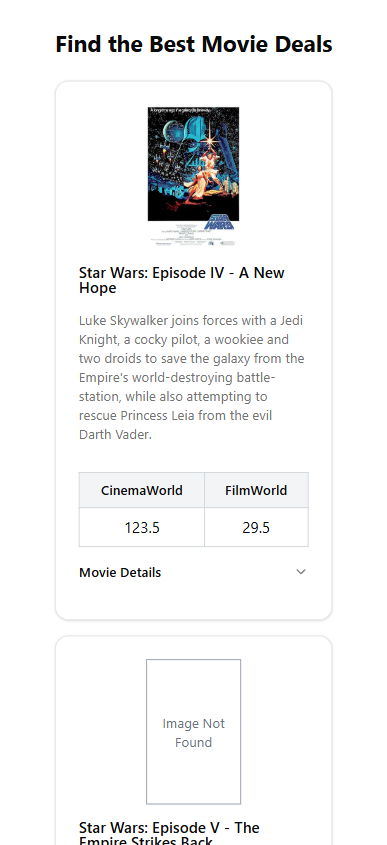
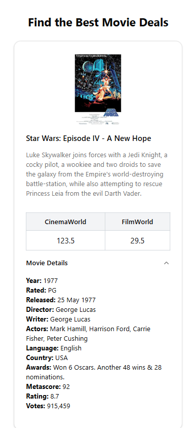
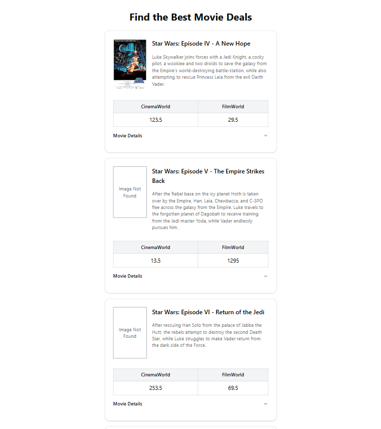
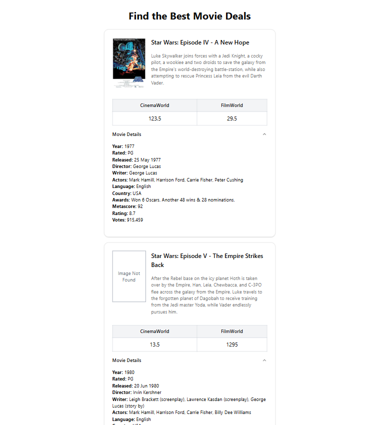

### **Movie API and Frontend Setup Guide**

## **Backend (API) - ASP.NET**
1. **Run the API:**  
   - Open and run `MovieApi.sln` in your development environment.  

2. **Configure the Environment Variables:**  
   - Create a `.env` file in the root directory.  
   - Use `.env.example` as a reference and update the required configuration settings. 
       **Example `.env` file:**
       ```sh
       MOVIE_API_URL=xxxxxxxx/api
       API_ACCESS_TOKEN=xxxxxxxxxxxx
       ```

3. **Start the API Server:**  
   - The API runs on **`http://localhost:5000`**.  
   - Ensure all configurations are correctly set before running the application.

---

## **Frontend - Vite with TypeScript**
1. **Navigate to the Frontend Directory**  
    ```
    cd movie-client
    ```
2. **Install Dependencies:**  
   ```
   npm install
   ```

3. **Run the Development Server:**  
   ```
   npm run dev
   ```
   
4. **Access the Website:**  
   - Open your browser and navigate to: **`http://localhost:5173`**

---

## **Screenshots**
### **Mobile Preview**
 

### **Desktop Preview**
 
---

### **Additional Notes**
- Ensure both the **backend API** and **frontend application** are running for full functionality.
- If you encounter issues, check the **.env configuration** and **port availability**.
